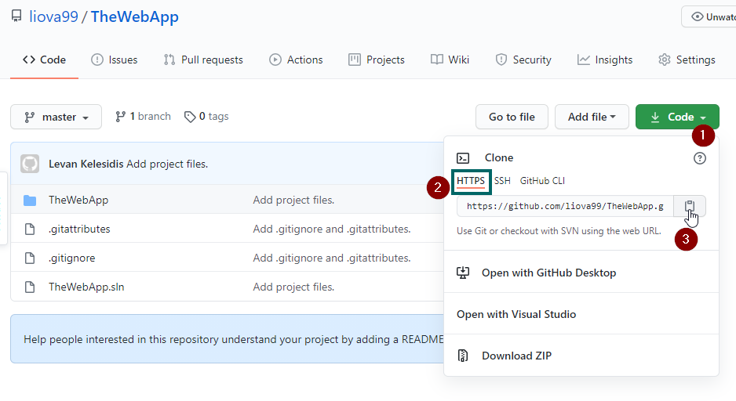
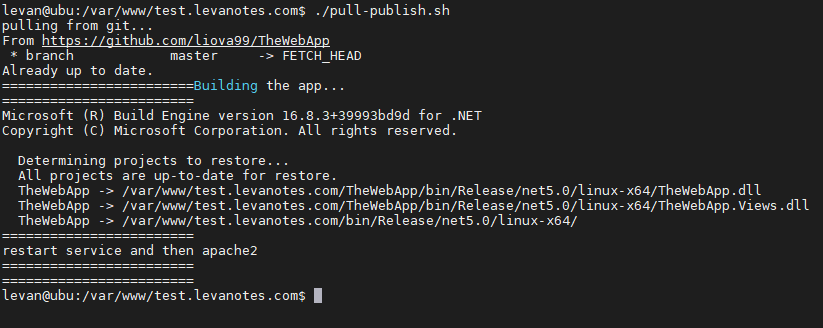

# Publish an ASP .Net Core web-app to a Linux server


## My Goal

My goal is to make the publish process easy and be able to host the app in a cheap 5$-10$ Linux VPS (virtual private server) like Amazon Lightsail  or Digital Ocean or whatever. 


### The workflow

1. I' am developing the app on a Windows 10  PC
2. Push the changes to github (it can be any git version control system)
3. On my VPS I run a  small script that pulls all the changes from github and build the app


## Other options?

### What about github-actions and self-hosted runners?

It's true. With self-hosted runners your app can be published automatically on your VPS. 

If your repo is private, go for it, but for public repos there are security concerns. Read here for more info:

https://docs.github.com/en/actions/hosting-your-own-runners/about-self-hosted-runners#self-hosted-runner-security-with-public-repositories


### Maybe Azure-Web-App?

With Azure App Services you can deploy your web-apps very easily, but if you are like me and you have  a couple small Wordpress, a couple Asp.Net  and some static web-apps, the costs may go high with Azure App-Services. But it definitely worth checking. By the time of writing they give up to new accounts 200USD in credit.  


## Prerequisite

* A VPS (I use Ubuntu 18.04 LTS)
* Installed apache2 and git on the server
* .Net SDK (I use .NET 5. Install instructions can be found here: https://docs.microsoft.com/en-us/dotnet/core/install/linux). 
* Ability to SSH into the Server (on windows I prefer MobaXterm. It combines among other things,  SSH and  FTP)
* A Git Repo


## Let's do it


For this example, like always I have created a new Asp.Net Core 5 razor web app template. 

**Note**: I did not put my project in to the same directory with my solution.


Then!

I pushed it to github. https://github.com/liova99/TheWebApp

Nice. I'm ready now to publish. 

My next steps are

1. Clone the repo in my server
2. Build/publish the app  
3. Configure apache (reverse proxy the traffic)
4. Create a service that will run the app in the background
5. Write a script to semi automate the pull and publish process

So!

### 1. Clone the repo in my server

I SSH to my Linux server. When you installs apache, it creates the www folder in /var/ directory so I navigate there. 

```bash
cd /var/www/
```

You can use any other folder. Many developers use an other folder to clone the application and then copy the compiled version in the /var/www/ directory. I prefer to have it all in one directory. 

Then!

I need to clone my repo, so I go to my github and copy the link to clone the repo (I use the HTTPS Link. I did not set up any SSH keys on my server and github).




Then!


I run following command

```bash
sudo git clone https://github.com/liova99/TheWebApp.git test.levanotes.com/
```


This command will create the test.levanotes.com folder for me and clone the app into this folder.

You can name your folder whatever you want. I prefer to name it with the website's domain name. If you have many of them, it is easier I think to find the one you look for.

###  2.  Build/publish the app  

Cool! Now I can build the app to see if everything compiles correctly. So I navigate to test.levanotes.com directory

 ```bash
cd test.levanotes.com
 ```

**Note**: This is how my folder structure looks like


Then

I run following command

```bash
sudo dotnet publish -c release -o TheWebApp/bin/Release/net5.0/linux-x64/ -f net5.0 -r linux-x64
```

Let's brake this command down

`dotnet publish` self explanatory

`-c release` -c stands for configure. I say here that this is a `release` build 

`-o /TheWebApp/bin/Release/net5.0/linux-x64/` -o stands for output (directory). For some reason if you don't specify any directory it will build the application in `/TheWebApp/bin/Release/net5.0/linux-x64/` directory **and** in the `/TheWebApp/bin/Release/net5.0/linux-x64/publish` directory. I could not find any solution for this (I thing issue) . If you find one please let me know.

**Note**: If you have your project in the same folder with your solution your output directory should be like ` bin/Release/net5.0/linux-x64/` (without the 'TheWebApp/')

`-f net5.0` -f stands for framework.

`-r linux-x64` -r stands for runtime

This is the output.


I can now run the app to see if everithing works fine!

I navigate to `TheWebApp/bin/Release/net5.0/linux-x64/` and run it.

**Note**: if you run the app without navigating to the directory, for example you run : `dotnet TheWebApp/bin/Release/net5.0/linux-x64/TheWebApp.dll`, then your working directory will be your current directory and the links to your static assets may not working (images, css or js etc). 

```bash
cd TheWebApp/bin/Release/net5.0/linux-x64/

sudo dotnet TheWebApp.dll
```


Super! 


### 3. Configure Apache (reverse proxy the traffic)

Now I can configure apache

First I stop the App by pressing Ctrl+C.

Then!

I navigate to apache configuration folder

```bash
cd /etc/apache2/sites-available/
```

I create my configuration file

```bash
sudo nano 001-test.levanotes.com.conf
```

The number (001) is very handy if you have many websites on your server because the order of the configuration files play a role in some circumstances.

I named the file like the domain name

Then I pasted the following code to the configuration file. This is the simplest possible configuration.

We pass the requests that are looking for test.levanotes.com to the http://localhost:5000 (or https://localhost:5001 for https)  

```bash
<VirtualHost *:80>

    # My Domain name
    ServerName test.levanotes.com
    
    ServerAdmin mail@levanotes.com
    
    # Reverse Proxy settings
    ProxyPreserveHost On
    ProxyPass / http://localhost:5000/
    ProxyPassReverse / http://localhost:5000/

    ErrorLog ${APACHE_LOG_DIR}/the-web-app-error.log
    CustomLog ${APACHE_LOG_DIR}/the-web-app-access.log common

    # Available loglevels: trace8, ..., trace1, debug, info, notice, warn,
    # error, crit, alert, emerg.
    # It is also possible to configure the loglevel for particular
    # modules, e.g.
    #LogLevel info ssl:warn

    ErrorLog ${APACHE_LOG_DIR}/error.log
    CustomLog ${APACHE_LOG_DIR}/access.log combined

</VirtualHost>

# vim: syntax=apache ts=4 sw=4 sts=4 sr noet

```


Save and exit nano

<div class="img-lg">
<video controls> <source src="/posts/2021/02/05/publish-asp-on-linux/save-nano-editor.mp4" type="video/mp4"></video>
</div>


Then!

 I check if the syntax of the configuration file has any errors and enable it

```bash
apachectl configtest
```

```bash
sudo a2ensite 001-test.levanotes.com.conf
```


Reload apache

```bash
sudo systemctl reload apache2
```

Nice!

### 4. Create a service that will run the app in the background

To create a service I navigate to: 

```bash
cd /etc/systemd/system/
```

Then!

I create a file. I name it `test.lenanotes.com.service`

```bash
sudo nano test.lenanotes.com.service
```

I paste this and save

```bash
[Unit]
Description=Levanotes will run forever 

[Service]
WorkingDirectory=/var/www/test.levanotes.com/TheWebApp/bin/Release/net5.0/linux-x64/
ExecStart=/usr/share/dotnet/dotnet /var/www/test.levanotes.com/TheWebApp/bin/Release/net5.0/linux-x64/TheWebApp.dll

Restart=always
# Restart service after 10 seconds if the dotnet service crashes:
RestartSec=10
KillSignal=SIGINT
SyslogIdentifier=dotnet-test.levanotes
# My username
User=levan
# Set Env Variables
Environment=ASPNETCORE_ENVIRONMENT=Production
Environment=ASPNETCORE_URLS=https://localhost:7510

[Install]
WantedBy=multi-user.target
```

So `WorkingDirectory` is the root directory of tha app.

`ExecStart` I define dotnet's location (usualy /usr/share/dotnet/) and the location of my app. So when I start this service dotnet will run TheWebApp.dll.

Then I define `SyslogIdentifier`, my username and set the environment to production.

To start the Service I Run 

```bash
sudo systemctl start test.levanotes.com.service
```

I can check if everything runs without errors with this command

```bash
sudo journalctl -u test.levanotes.com.service -e 
```

`-e` will start the log at the end.

This should be the output


So I can now open a browser and navigate to test.levanotes.com 


### 5. Write a script to semi automate the pull and publish process

Now I need to create a small script that will be pull all the changes from github and build/publish my app. 

That is straightforward to do. 

First I navigate to the test.levanotes.com directory.

```bash
cd /var/www/test.levanotes.com
```

Then!

I create a file, I name it pull-publish.sh

```bash
sudo nano pull-publish.sh
```

Paste following in it

```bash
#!/bin/bash
printf "pulling from git...\n"
sudo git pull origin master
printf "========================\n"

printf "Building the app... \n"
printf "========================\n"
sudo dotnet publish -c release -o TheWebApp/bin/Release/net5.0/linux-x64/ -f net5.0 -r linux-x64
printf "========================\n"

printf "restart service and then apache2 \n"
printf "========================\n"
sudo systemctl restart test.lenanotes.com.service
sudo systemctl restart apache2
printf "========================\n"

```


Make the script executable

```bash
sudo chmod +x pull-publish.sh
```

Run it

```bash
./pull-publish.sh
```



 That's it!


